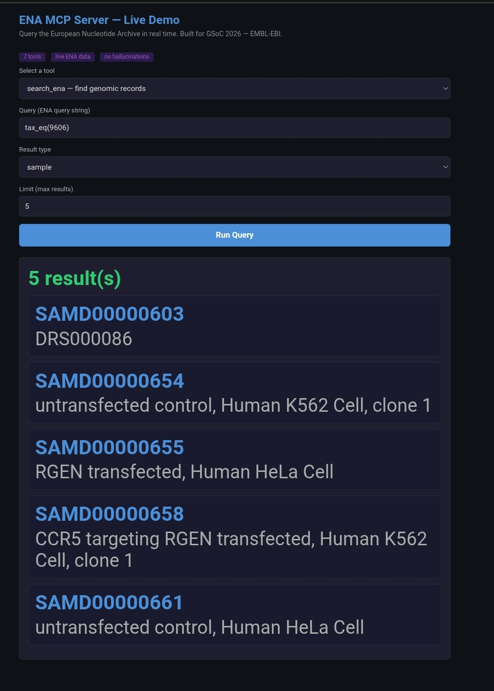

# ENA MCP Server

A Model Context Protocol (MCP) server that exposes European Nucleotide Archive (ENA) REST APIs as callable tools for AI agents.

Built as a GSoC 2026 proof of concept for EMBL-EBI.

## Live Demo

Query real genomic data from ENA directly in your browser. No setup needed.

## What it does

Prevents AI hallucination by forcing AI agents to fetch real verified data from ENA before responding. The agent cannot invent genomic records because every response is fetched from ENA in real time.

## Features

- 7 working MCP tools covering core ENA endpoints
- Input validation on all tools
- Caching layer repeated queries return from memory for 5 minutes
- Rate limiting max 5 requests per second to avoid hitting ENA limits
- Error handling network failures return clean messages instead of crashing
- Logging every tool call and ENA request recorded with a timestamp
- Docker support run anywhere with a single command
- 7 pytest tests all passing
- Web demo anyone can query ENA from a browser

## Tools

| Tool | Endpoint | Description |
|------|----------|-------------|
| search_ena | /search | Search ENA for genomic records |
| count_ena | /count | Count records matching a query |
| get_searchable_fields | /searchFields | Get fields you can filter by |
| get_return_fields | /returnFields | Get fields you can retrieve |
| get_result_types | /results | List all data types in ENA |
| get_accession_types | /accessionTypes | Get valid accession formats |
| get_controlled_vocab | /controlledVocab | Get valid values for a field |

## Setup

pip install -r requirements.txt
python server.py

## Run with Docker

docker build -t ena-mcp-server .
docker run ena-mcp-server

## Run tests

pytest test_server.py -v

## Example queries

Search for human samples: tax_eq(9606), result_type: sample
Count mouse sequencing runs: tax_eq(10090), result_type: read_run
Get valid instrument platforms: field: instrument_platform

## Project structure

ena_search.py proof of concept ENA API client
server.py production MCP server with 7 tools
test_server.py pytest test suite
demo.html browser based demo for all 7 tools
Dockerfile container setup
requirements.txt dependencies

## Built for

Google Summer of Code 2026 - EMBL-EBI
Project: Expose a Subset of ENA REST Services as MCP
Mentor: Senthilnathan Vijayaraja
GitHub: https://github.com/isalawal/ena-mcp-gscos
